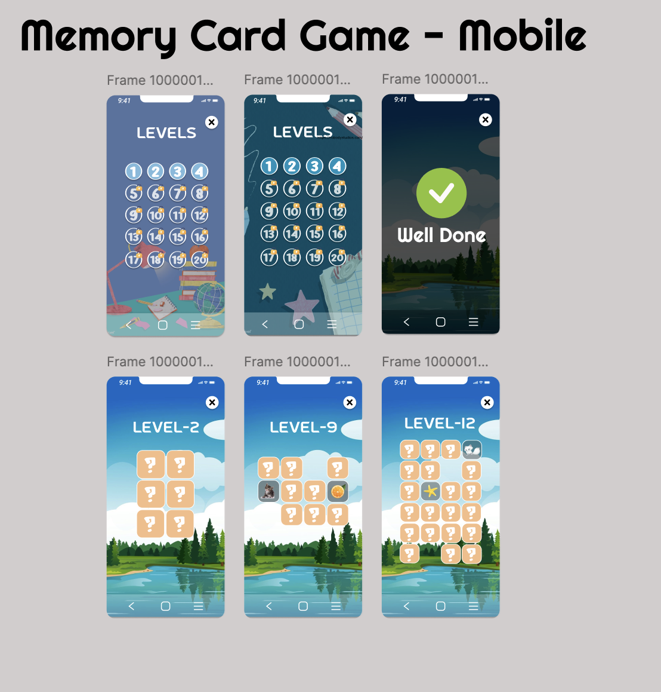
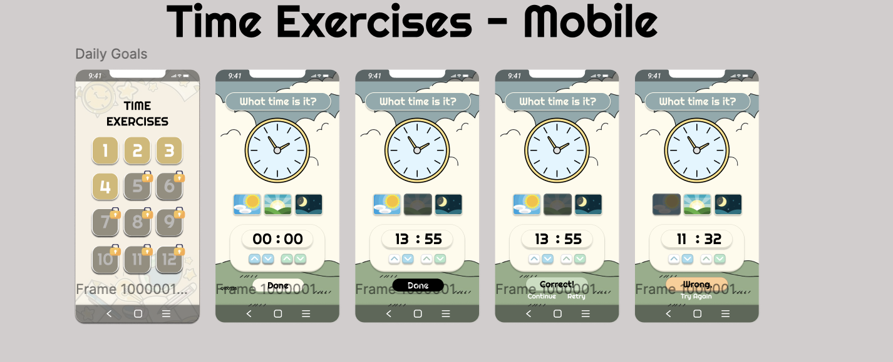
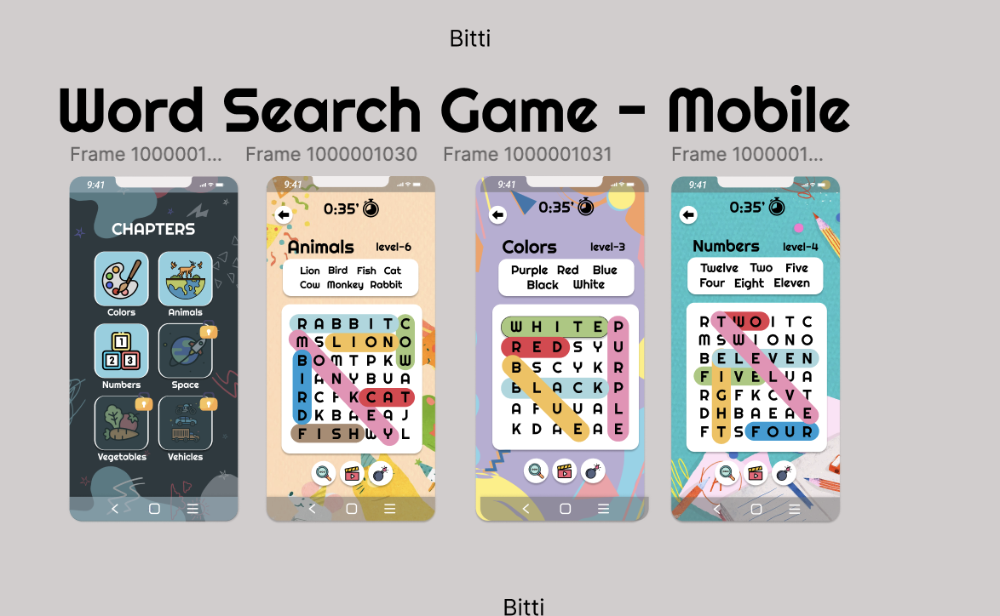

# Child Learning Game - 2024  

**Child Learning Game** is a mobile application developed in the summer of 2024 as a **freelance project**. The app aims to support **child development** by combining **fun activities** with **educational exercises**, making learning an enjoyable experience for kids of all ages.  

With a variety of games and exercises, the app enhances essential skills like **memory**, **problem-solving**, **time management**, and **vocabulary building**.  

---

## Features  

### WordSearch Game  
The **WordSearch Game** is a key feature designed to enhance **vocabulary** and **spelling skills**. Children search for hidden words in a grid, fostering **pattern recognition** and **cognitive development**.  

- **Age-Specific Levels**: Word lists tailored for different age groups.  
- **Interactive Themes**: Topics like animals, seasons, and colors keep learning fun.  
- **Time Challenges**: Encourages focus and quick thinking.  

  

---

### Time Exercises  
Help children learn how to read and manage time with **interactive clock exercises**. Kids can practice matching **analog clocks** with digital times, building a foundation for time-related skills.  

- **Customizable Challenges**: Adjust difficulty based on age and progress.  
- **Visual Learning**: Engaging visuals make time concepts easier to grasp.  

  

---

### Memory Game  
The classic **Memory Game** enhances **focus**, **memory retention**, and **logical thinking**. Players match card pairs within a set time to earn points.  

- **Dynamic Levels**: Difficulty scales with the player's progress.  
- **Colorful Designs**: Cards feature kid-friendly, visually appealing themes.  

  

---

### Activities  
The app also offers a variety of **fun activities** to foster creativity and logical thinking. These activities include puzzles, matching games, and creative exercises designed to suit different age groups.  

  

---

## How to Run  
1. Clone the repository:  
   ```bash  
   git clone https://github.com/yourusername/child-learning-game.git  
